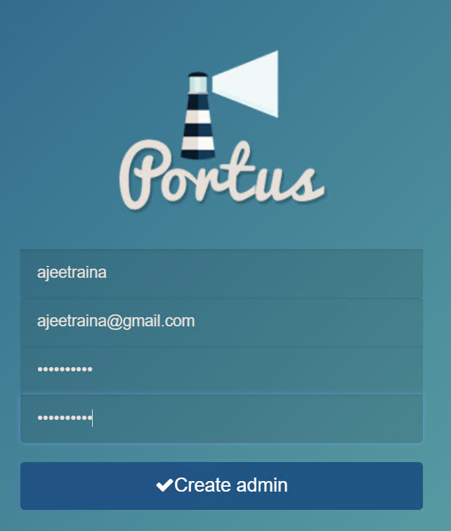
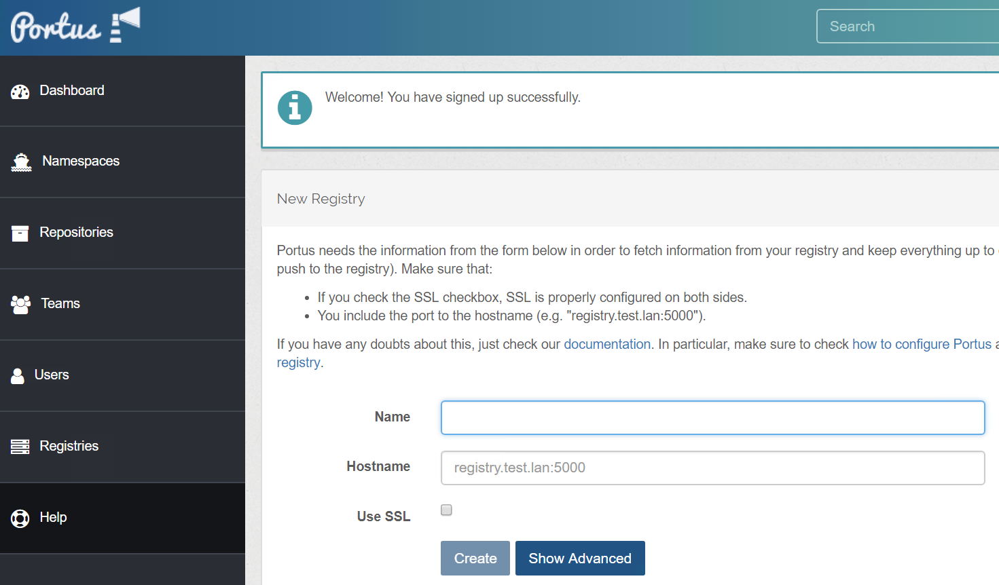
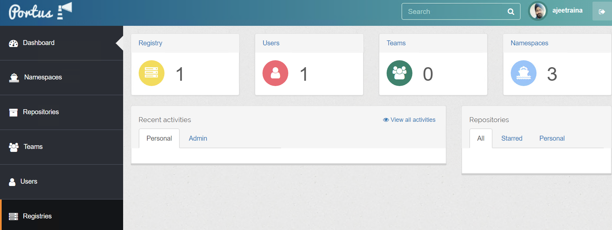

# [Building Web Frontend/UI for Local Docker Registry using Portus](https://dockerlabs.collabnix.com/beginners/portus/)

This project is cloned from [SUSE/Portus](https://github.com/SUSE/Portus) and has been successfully run in an Ubuntu 22.04 environment.

## Cloning the Repository

```
git clone https://github.com/Sakurajima-sight/Portus.git
```

## Change directory into the cloned folder

```
cd Portus
```

## Bring up Portus Application

```
docker-compose up -d
```

## compile Webpack assets

```
docker-compose run portus bundle exec rake webpack:compile
```

## Verifying the Portus services

```
 docker-compose ps
       Name                     Command             State              Ports
---------------------------------------------------------------------------------------
portus_background_1   bundle exec rails runner /    Up      3000/tcp
                      ...
portus_clair_1        /clair -config /clair.yml     Up      0.0.0.0:6060->6060/tcp,
                                                            0.0.0.0:6061->6061/tcp
portus_db_1           /docker-entrypoint.sh mysq    Up      3306/tcp
                      ...
portus_portus_1       bundle exec rails runner /    Up      0.0.0.0:3000->3000/tcp
                      ...
portus_postgres_1     docker-entrypoint.sh          Up      5432/tcp
                      postgres
portus_registry_1     /entrypoint.sh /etc/docker    Up      0.0.0.0:5000->5000/tcp,
                      ...                                   0.0.0.0:5001->5001/tcp
portus_webpack_1      bash /srv/Portus/examples/    Up
                  ...
```





## Provide Docker Registry Details

Once you login to Portus, you will need to provide Docker Registry details:

```
- Name
- 172.17.0.1:3000
```

**Please remember that Portus is designed to handle only a single private Registry.**


